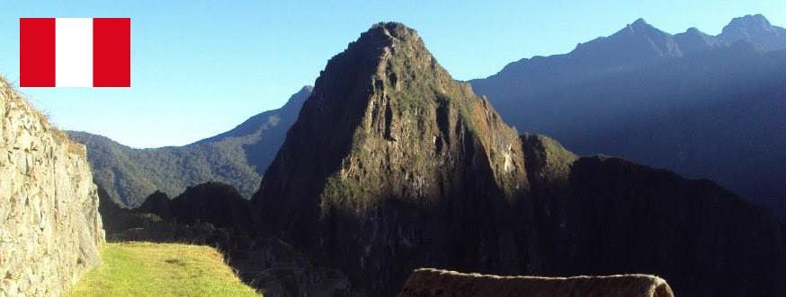

# Discovering Peru

Since the lockdown and the stricter rules on travelling and crossing boarders, I wanted to create a travel site based on one of my best travel experiences! At least give people some inspiration. and at best take a group with me to travel back to Peru!

 
## UX
 
- As a traveller, I want to find inspiration for a journey shedule in Peru, so that I can have a great travel experience.
- As a consumer, I want to go travel with someone who has been in the country allready, so I don't fall for the tourist traps.
- As a traveller, I want to travel in a small group of people, so I can get to know people from my own country too.

### Wireframes

- [Home page](assets/Wireframes/Homepage.pdf)
- [Gallery page](assets/Wireframes/gallerypage.pdf)
- [Journey page](assets/Wireframes/Journeypage.pdf)
- [Contact page](assets/Wireframes/contactpage.pdf)

## Features

- Site with 4 individual pages
- Fixed navigation, so navigation stays easy
- Images can be viewed by clicking right or left for the next one or a previous one
- Contact form with radio buttons
 

## Technologies Used

In this section, you should mention all of the languages, frameworks, libraries, and any other tools that you have used to construct this project. For each, provide its name, a link to its official site and a short sentence of why it was used.

- HTML5 
- CSS3
- Bootstrap 4
- GitPod
- GitHub
- Font Awesome
- Google Fonts
- Snagit Editor software, to edit pictures very easy
- [Image Resizer](https://imageresizer.com/) to resize pictures
- [Figma](https://www.figma.com) for wireframing, since it's browserbased and I enjoy this kind of flexibility. I followed [this](https://youtu.be/6t_dYhXyYjI) tutorial from Butter Academy to get to know it better

## Testing

Needs to be done yet

## Deployment

Needs to be done yet

## Credits

- Contact form: the code from this form is based on the 'love running' project and the 'Resume Rosie' project earlier on in the course

### Content

- Text content is self written

### Media

- The photos used in this site were obtained from my own photo library, while the pictures from the gallery page are from the free photolibrary [Pexels](https://www.pexels.com/)
- The header from the README.md file is a picture of my own. The flag of Peru on the image I got from [Wikipedia](https://en.wikipedia.org/wiki/Peru)

### Acknowledgements

- I received inspiration for this project from my journey to Peru. It was a fantastic experience!
